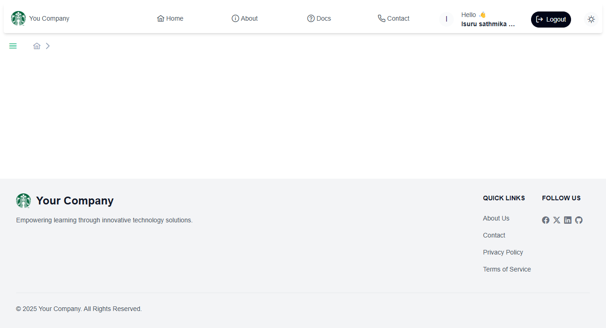
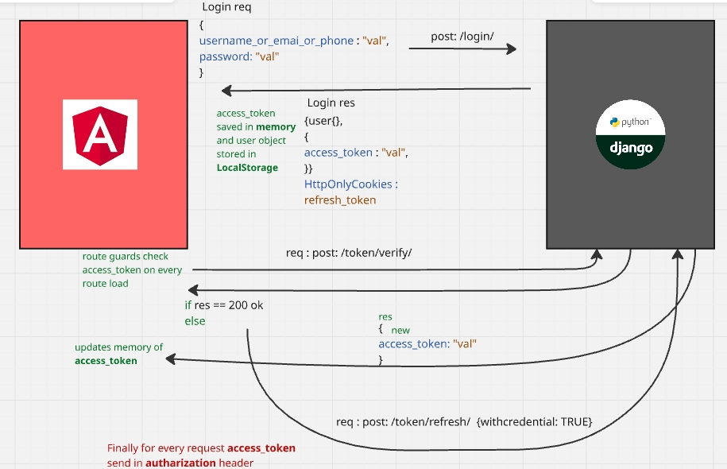
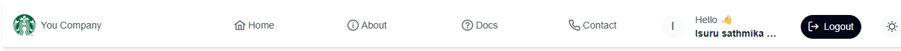
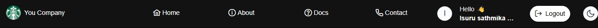
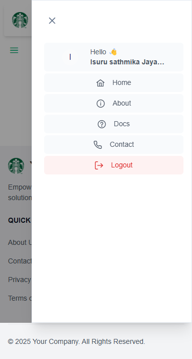
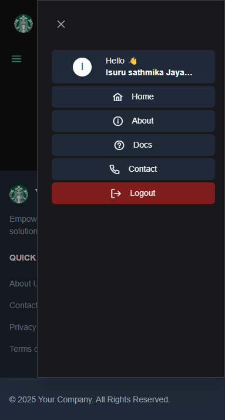
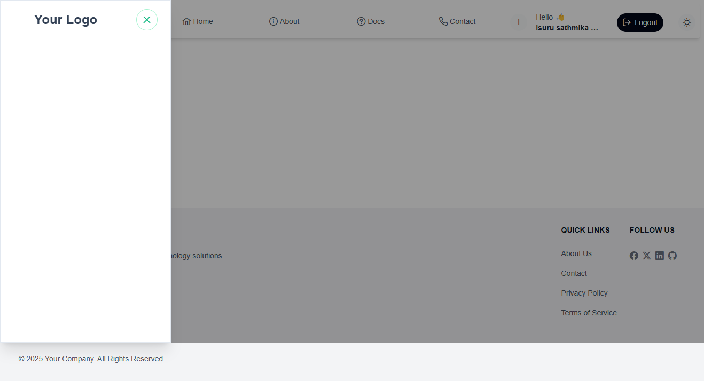
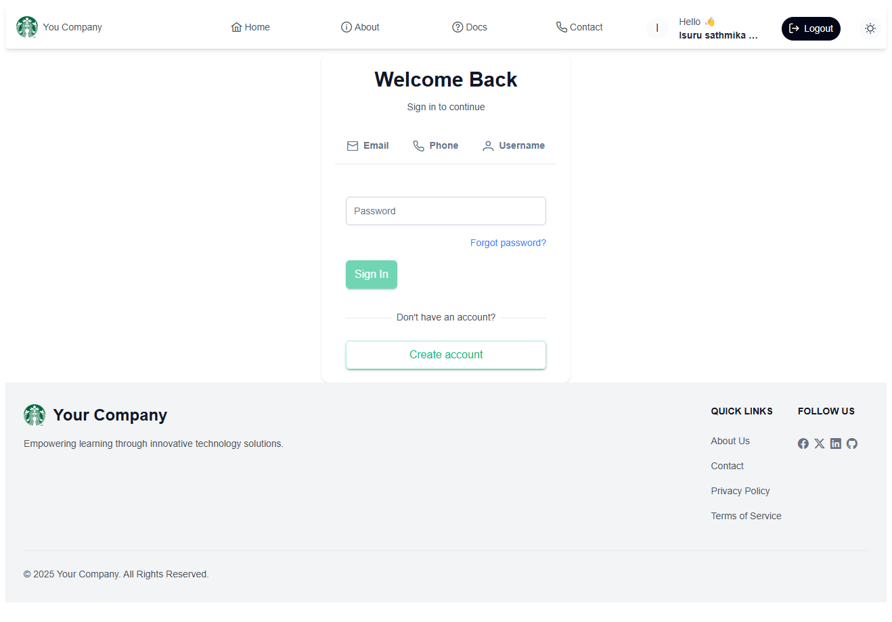
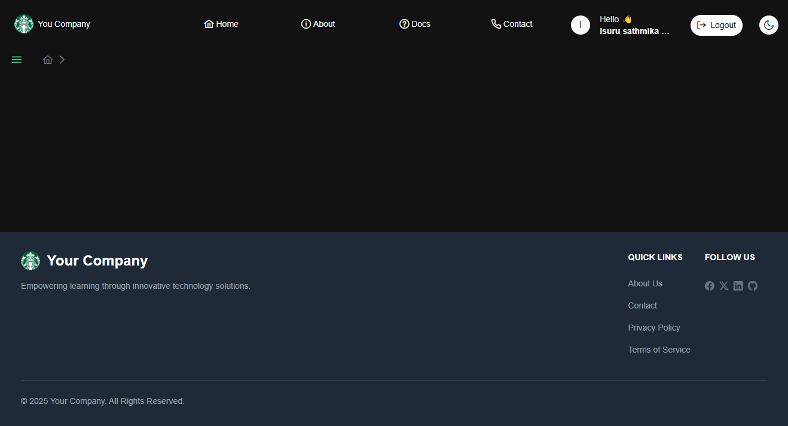
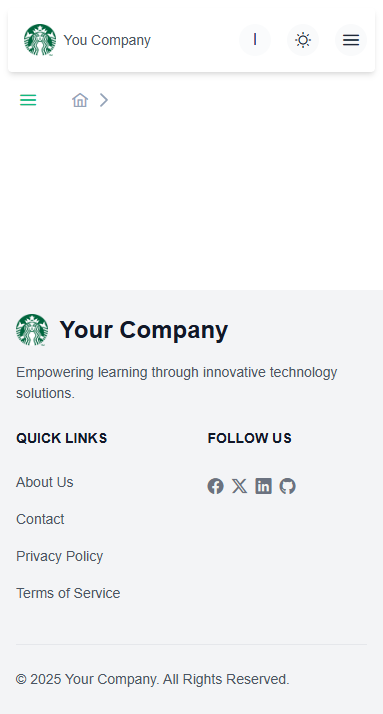

# Angular ERP Boilerplate

A production-ready Angular 17+ boilerplate for Enterprise Resource Planning (ERP) systems with built-in authentication, role-based access control, and PrimeNG integration.



## Table of Contents
- [Features](#features)
- [Prerequisites](#prerequisites)
- [Getting Started](#getting-started)
- [Authentication System](#authentication-system)
- [Project Structure](#project-structure)
- [Core Components](#core-components)
- [Security Features](#security-features)
- [Theming and Styling](#theming-and-styling)
- [Development Guide](#development-guide)
- [Screenshots](#screenshots)

## Features

### Core Features
- 🚀 Modern Angular 17+ with Standalone Components
- 🎨 PrimeNG UI Components Integration
- 🌓 Dark/Light Theme Support
- 📱 Fully Responsive Layout
- 🔒 Role-Based Access Control (RBAC)
- 🍞 Breadcrumb Navigation
- 🛡️ Protected Routes
- 🔄 Token-based Authentication with Auto-refresh

### Authentication Features
- JWT Authentication with HTTP-Only Cookie Refresh Tokens
- Multiple Login Methods (Email/Phone/Username)
- Remember Me Functionality
- Forgot Password Flow
- Auto Token Refresh
- Session Management

### UI/UX Features
- Modern Dashboard Layout
- Responsive Navigation
- Mobile-friendly Sidebar
- Dark Mode Support
- Toast Notifications
- Loading Indicators

## Prerequisites

- Node.js (v18+)
- Angular CLI (v17+)
- A compatible API backend (with authentication endpoints)

## Getting Started

### Installation

1. Clone the repository:
```bash
git clone https://github.com/LEOQuester/AngularBoilerPlate
cd AngularBoilerPlate
```

2. Install dependencies:
```bash
npm install
```

3. Configure environment variables:
   - Navigate to `src/environments`
   - Copy `environment.ts.example` to `environment.ts`
   - Update API endpoints and other configurations

4. Start the development server:
```bash
npm start
```

The application will be available at `http://localhost:4200`

## Authentication System

### How Authentication Works

The system uses a dual-token approach for security:
1. Access Token (JWT) for API authentication
2. HTTP-Only Cookie Refresh Token for security



### Key Authentication Files

- `src/app/services/auth/auth.service.ts` - Main authentication service
- `src/app/services/auth/auth.guard.ts` - Route protection
- `src/app/services/auth/auth.interceptor.ts` - HTTP interceptor for token handling

### Authentication Configuration

1. Configure API endpoints in `environment.ts`:
```typescript
export const environment = {
  production: false,
  apiUrl: 'your-api-url',
  auth: {
    loginEndpoint: '/api/auth/login',
    refreshTokenEndpoint: '/api/auth/refresh',
    logoutEndpoint: '/api/auth/logout'
  }
};
```

2. Customize authentication behavior in `auth.service.ts`:
```typescript
// Token refresh timing
private readonly TOKEN_REFRESH_THRESHOLD = 5 * 60 * 1000; // 5 minutes

// Storage keys
private readonly USER_KEY = 'user';
```

## Project Structure

```
src/
├── app/
│   ├── components/          # Reusable components
│   │   ├── breadcrumb/     # Breadcrumb navigation
│   │   ├── footer/         # Application footer
│   │   ├── navbar/         # Top navigation bar
│   │   └── sidebar/        # Side navigation menu
│   ├── directives/         # Custom directives
│   │   └── has-role/       # Role-based access directive
│   ├── guards/             # Route guards
│   ├── models/            # Interfaces and types
│   ├── pages/            # Page components
│   └── services/         # Application services
├── assets/              # Static assets
└── environments/       # Environment configurations
```

## Core Components

### Navbar Component
Location: `src/app/components/navbar`

Features:
- User profile display
- Dark mode toggle
- Responsive design
- Logout functionality



Desktop Dark Mode:


Mobile View:


Mobile Dark Mode:


Customization:
```typescript
// navbar.component.ts
menuItems = [
  { label: 'Home', link: '/home', icon: 'pi pi-home' },
  // Add your menu items here
];
```

### Sidebar Component
Location: `src/app/components/sidebar`

Features:
- Collapsible navigation
- Dynamic menu items
- Role-based menu filtering
- Mobile-responsive



### Breadcrumb Component
Location: `src/app/components/breadcrumb`

Usage in routes:
```typescript
// app.routes.ts
{
  path: 'dashboard',
  component: DashboardComponent,
  data: { breadcrumb: 'Dashboard' }
}
```

## Security Features

### Role-Based Access Control

1. Using the HasRole Directive:
```html
<!-- Only show to admins -->
<button *appHasRole="['ADMIN']">Admin Action</button>

<!-- Multiple roles -->
<div *appHasRole="['MANAGER', 'ADMIN']">
  Restricted Content
</div>
```

2. Route Protection:
```typescript
// app.routes.ts
{
  path: 'admin',
  component: AdminComponent,
  canActivate: [AuthGuard],
  data: { roles: ['ADMIN'] }
}
```

### Token Management

The system automatically:
- Refreshes tokens before expiry
- Handles token invalidation
- Manages concurrent requests
- Implements secure storage

## Theming and Styling

### Theme Configuration

1. Dark/Light Mode:
   - Toggle using navbar button
   - Persists user preference
   - Affects all components

2. Custom Theme Colors:
   - Edit in `styles.css`:
```css
:root {
  --primary-color: #2196F3;
  --secondary-color: #607D8B;
  // Add your custom colors
}
```

### PrimeNG Customization

Location: `src/styles/primeng/`
- Override component styles
- Customize component themes
- Add custom animations

## Development Guide

### Adding New Pages

1. Create component:
```bash
ng generate component pages/your-page
```

2. Add route:
```typescript
// app.routes.ts
{
  path: 'your-page',
  component: YourPageComponent,
  canActivate: [AuthGuard],
  data: { 
    roles: ['USER'],
    breadcrumb: 'Your Page'
  }
}
```

### Error Handling

The boilerplate includes global error handling:
- HTTP error interceptor
- Toast notifications
- Error logging
- Validation messages

### Best Practices

1. Authentication
   - Always use AuthGuard for protected routes
   - Implement proper token refresh
   - Handle session timeouts

2. Components
   - Use standalone components
   - Implement proper error handling
   - Follow Angular style guide

3. Performance
   - Lazy load modules
   - Implement proper caching
   - Use OnPush change detection

## Screenshots

### Login Page


### Dashboard


### Dashboard Dark Mode


### Mobile View


## Contributing

1. Fork the repository
2. Create your feature branch
3. Commit your changes
4. Push to the branch
5. Create a Pull Request

## License

This project is licensed under the MIT License - see the [LICENSE](LICENSE) file for details.

## Support

For support, please open an issue in the repository.

---
Note: Replace the screenshot placeholders in the docs/images/ directory with actual screenshots of your application.
